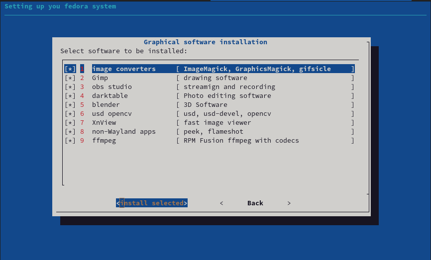
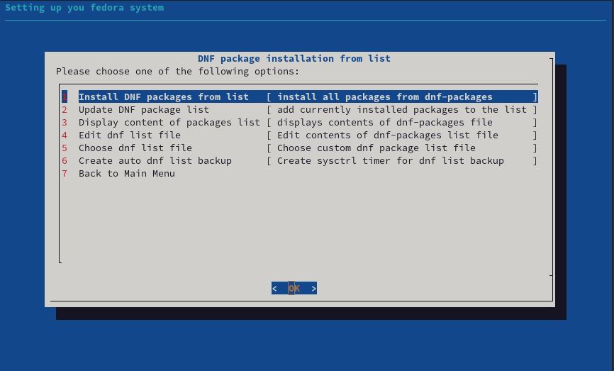
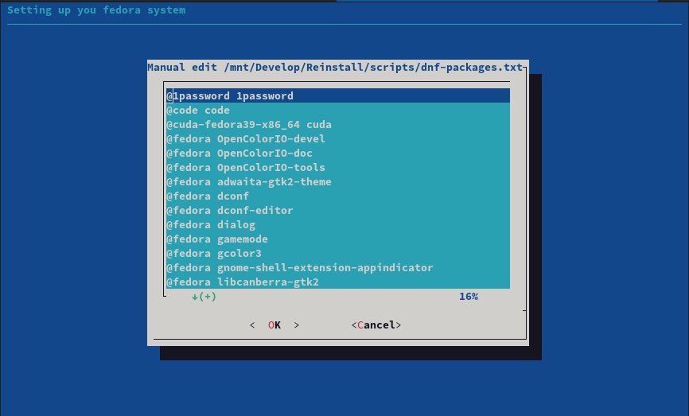
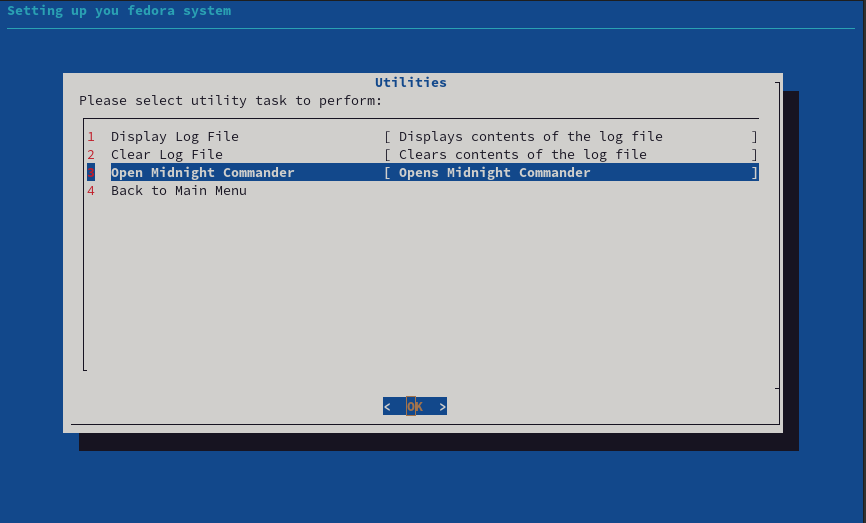

## About:
You know the feeling when you have to re-install system as something broke, remembering what you have installed and how it was setup ?
Here is an easy way to put together all nessecery steps to bring your system where it was, based on Thomas E. Dickey [dialog package](https://invisible-island.net/dialog).

Inside /scripts/submenu_template.sh there is a template example how to create simple sub menu tailored for your own needs.

Inspired by [fedorable](https://github.com/smittix/fedorable), intially forked but then, I have created own version from scratch.

## Usage
Please check out project [WIKI page](../../wiki)

## Features:
- Store current user dnf/flatpak package list
- Install  dnf/flatpak  packages from the list
- Edit and choose  dnf/flatpak package list file
- Install non dnf packages and their repos (google-chrome, vscode, sublime)
- easy way to view logs
- provided template for easy sub-menu creation

## Files
For detailed instructions on how to use those, please reffer to project [WIKI page](../../wiki)
- **flatpak-packages.txt** - This file contains a list of all flat packages to install you can customise this manually or directly via app.
- **dnf-packages.txt** - This file contains a list of all applications that will be installed in a format of "@repository package_name".
- **gnome-extensions.txt** - This file contains a list of all gnome extensions to be installed on your system".

